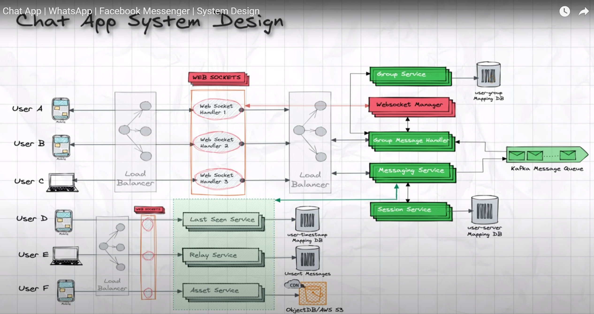
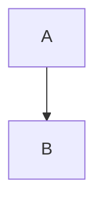
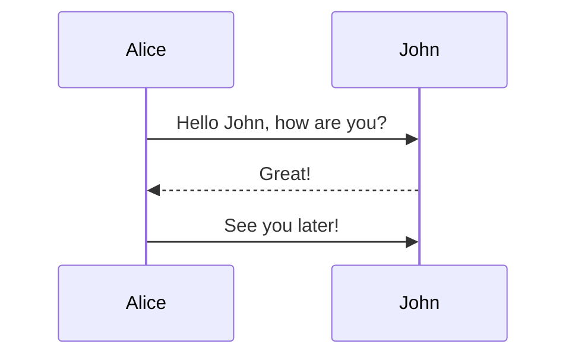
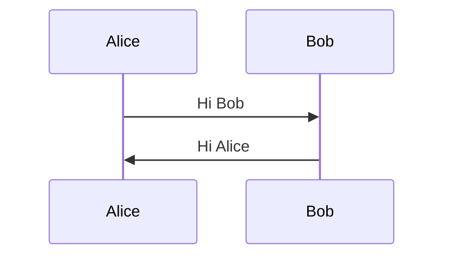
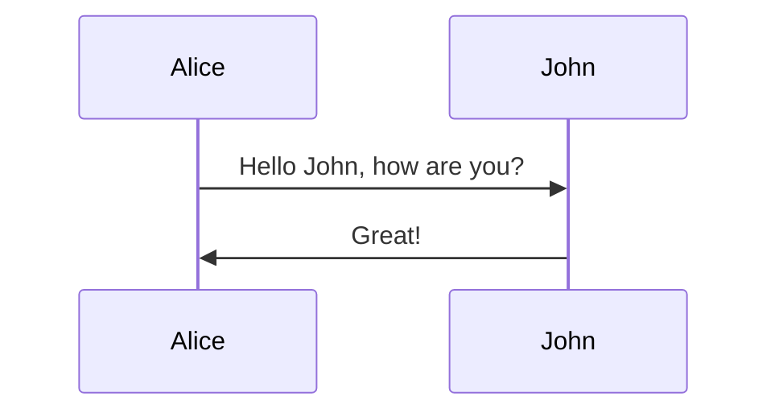
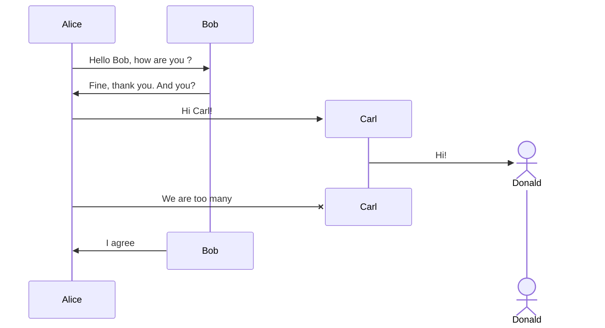
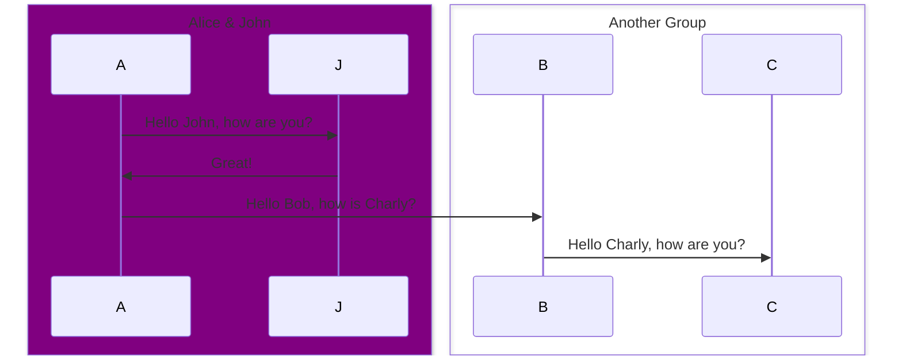
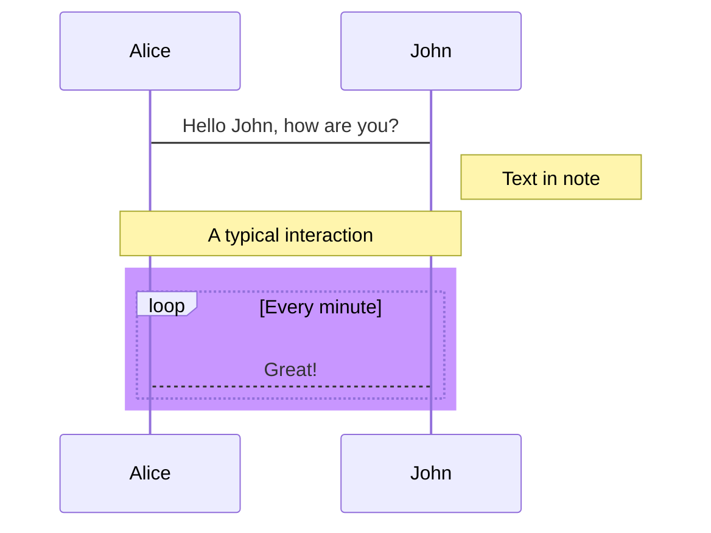

## Rust
- [Rust Async Programming](https://rust-lang.github.io/async-book/02_execution/04_executor.html)

- [Rust Learning](https://github.com/ctjhoa/rust-learning?tab=readme-ov-file)

- [Rust Learning Videos](https://www.youtube.com/watch?v=pf8eQwWkTaY&list=PLDbRgZ0OOEpUkWDGqp91ODn0dk7LPBAUL&index=15)

## C++
- [Coroutine](https://www.jeremyong.com/cpp/2021/01/04/cpp20-coroutines-a-minimal-async-framework/)

- [C++ Talks - Concurrency, Asynchronous Talk](https://www.youtube.com/watch?v=0i_pFZSijZc&list=PLrR3oTpJZ9TjkdzwIxhlxb4Ku7yVWij5V&index=17)

- [C++ - ASIO And Coroutines](https://www.youtube.com/watch?v=0i_pFZSijZc&list=PLrR3oTpJZ9TjkdzwIxhlxb4Ku7yVWij5V&index=19)

- [Network programming using coroutines](https://habr.com/en/articles/768418/)

- [C++20 Coroutines: sketching a minimal async framework](https://www.jeremyong.com/cpp/2021/01/04/cpp20-coroutines-a-minimal-async-framework/)

## Frontend
- [Twitter clone with React.js, MongoDB and tailwind css](https://www.youtube.com/watch?v=P4kuSxpjA48&list=PLChiukrA-RMOEB1PRQqB1NITIRsDz9pIN)

## Coding
- [TopCoder Programming Learning](https://www.topcoder.com/thrive/search?tags[]=Competitive%20Programming%20Tutorials)


## Design
- [Cassandra - Medium](https://medium.com/geekculture/system-design-solutions-when-to-use-cassandra-and-when-not-to-496ba51ef07a)
  - Masterless. Any node can accept writes and replicated to other nodes.
  - When looking for a value, any node can accept the request and finds out by gossipping who owns that values.
  - its support for ACID is quite weak.


- [Mastering Chaos - A Netflix Guide to Microservices](https://www.youtube.com/watch?v=CZ3wIuvmHeM&list=PLqXBqaWzmb_c0d3jHhxk8cF0ldP6EGfvL)
  - Microservice architecture
      - Evolution from monolithic to microservice architecture.
      - Monolithic java codebase with Apache tomcat java web.
      - Monolithic Orcale Database.
      - Tightly coupled architector.
      - New architecture:
          - Edge Service: ELB -> ZUUL (proxy layer for dynamic routing) -> Netflix API GW
          - Middle Tier (platform)
      - Microservice abstraction
          - Client Application - Client Library - EV Cache Client, Service Client - EV Cache - Database
          - Hystrix: for microservice management. [failure/timeout]
  - Challenges and solutions 
  - 

- [Twitter](https://www.codekarle.com/system-design/Twitter-system-design.html)

- [Dropbox](https://medium.com/@narengowda/system-design-dropbox-or-google-drive-8fd5da0ce55b)
    <br />
    

- [Distributed cache System design](https://www.youtube.com/watch?v=DUbEgNw-F9c)
    - Medium - https://medium.com/system-design-concepts/distributed-cache-system-design-9560f7dd07f2
  
- [Facebook and memcached - Tech Talk - Mark](https://www.youtube.com/watch?v=UH7wkvcf0ys&t=1s)

- [Chat APP Message System](https://www.youtube.com/watch?v=xyLO8ZAk2KE)
  - 
  - [Another one](https://www.youtube.com/watch?v=Pq5Iy0FGYMM)
  - [How many websockets a server can handle](https://stackoverflow.com/questions/17448061/how-many-system-resources-will-be-held-for-keeping-1-000-000-websocket-open)
  
  - [More details on websockets](https://stackoverflow.com/questions/46314065/how-do-websockets-work-in-detail)
    <details>
    Websockets create and represent a standard for bi-directional communication between a server and client. This communication channel creates a TCP connection which is outside of HTTP and is run on a seperate server. To start this process a handshake is performed between the server and client.

    Here is the work flow

    1) The user makes an HTTP request to the server with an upgrade header, indicating that the client wishes to establish a WebSocket connection.

    2) If the server uses the WebSocket protocol, then it will accept the upgrade and send a response back.

    3) With the handshake finished, the WebSocket protocol is used from now on. All communications will use the same underlying TCP port. The new returning status code, 101, signifies Switching Protocols.

    As part of HTML5 it should work with most modern browsers.
    </details>

   - [GFG](https://www.geeksforgeeks.org/desiging-facebook-messenger-system-design-interview/?ref=lbp)


- [Design a Geo-Spatial index for real-time location search](https://kousiknath.medium.com/system-design-design-a-geo-spatial-index-for-real-time-location-search-10968fe62b9c)

- [Development with Large Language Models Tutorial – OpenAI, Langchain, Agents, Chroma](https://www.youtube.com/watch?v=xZDB1naRUlk)
- [Github](https://github.com/pythonontheplane123/LLM_course_part_1)
- [NLP Projects](https://github.com/costezki/awesome-nlprojects?tab=readme-ov-file)
- [Plagiarism-checker-Python](https://github.com/Kalebu/Plagiarism-checker-Python/blob/master/app.py)
- [Regression Intro - Practical Machine Learning Tutorial with Python p.2](https://www.youtube.com/watch?v=JcI5Vnw0b2c&list=PLQVvvaa0QuDfKTOs3Keq_kaG2P55YRn5v&index=2)
- [Predict The Stock Market With Machine Learning And Python](https://www.youtube.com/watch?v=1O_BenficgE)
- [Project 2: Diabetes Prediction using Machine Learning with Python | End To End Python ML Project](https://www.youtube.com/watch?v=xUE7SjVx9bQ&list=PLfFghEzKVmjvuSA67LszN1dZ-Dd_pkus6&index=2)
- [End To End LLM Project Using LLAMA 2- Open Source LLM Model From Meta](https://www.youtube.com/watch?v=cMJWC-csdK4)

## Appendix















# Sample Tables
| Command | Description |
| --- | --- |
| `git status` | List all *new or modified* files |
| `git diff` | Show file differences that **haven't been** staged |

| Left-aligned | Center-aligned | Right-aligned |
| :---         |     :---:      |          ---: |
| git status   | git status     | git status    |
| git diff     | git diff       | git diff      |

## Collapsed Sections
<details>

<summary>Collapsed Section</summary>

### You can add a header

You can add text within a collapsed section. 

You can add an image or a code block, too.

```ruby
   puts "Hello World"
```

</details>

## Task List
- [x] #739
- [ ] https://github.com/octo-org/octo-repo/issues/740
- [ ] Add delight to the experience when all tasks are complete :tada: